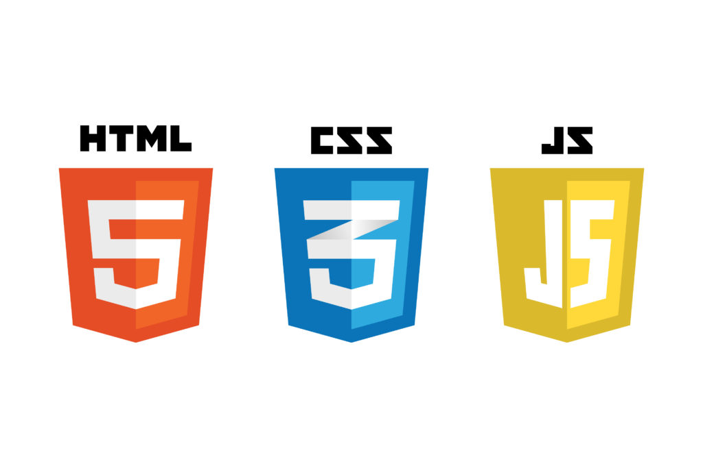
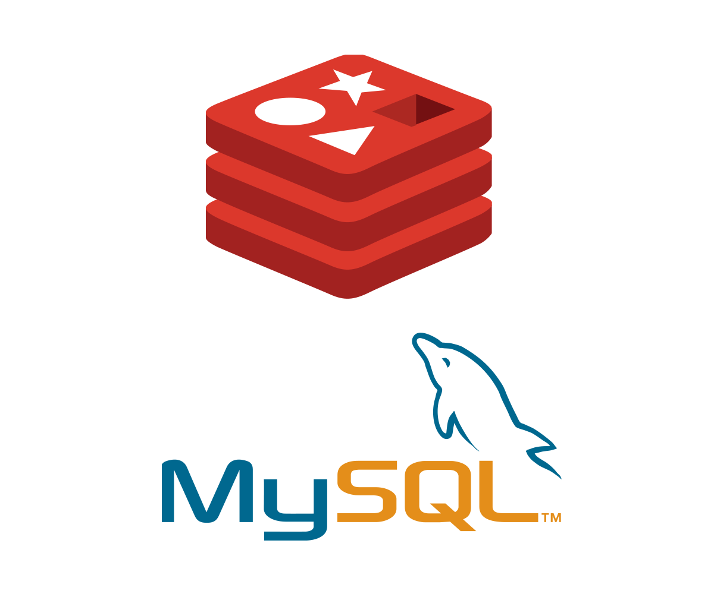
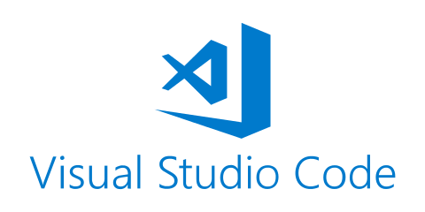
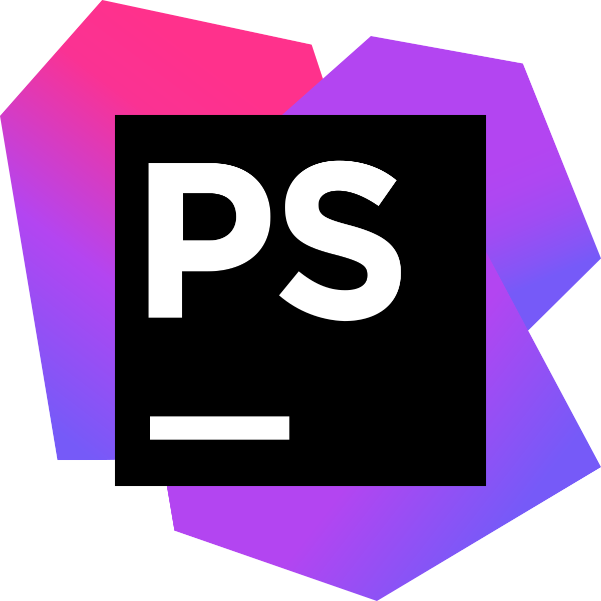

# Technologies to be used

## Front-end web development

- HTML5
- CSS3
- JavaScript

## Back-end development

- PHP

## Database

- MySQL for main data storage
- [Redis for cache storage](https://redis.io/)

## IDE

- [Visual Studio Code](https://code.visualstudio.com/)
- [PhpStorm](https://www.jetbrains.com/phpstorm/)

## Development server

- [XAMPP](https://www.apachefriends.org/)

## Version control & collaboration

- [GitHub](https://www.github.com)

## Project management tool

- [Trello](https://www.trello.com)

## Diagram drawing tool

- [draw.io](https://app.diagrams.net)

## Storage for documents

- Google Drive

## Meetings

- MS Teams

